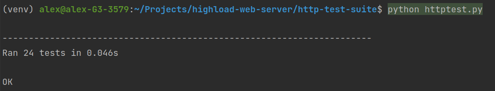

# highload-web-server

## Архитектура
Python + prefork + coroutines
- открывается socket
- заранее создается заданное количество воркеров, которые слушают socket
- когда процесс-воркер получает клиента по socket'у, создаётся корутина (asyncio), которая обрабатывает запрос клиента

## Запуск
Python Web Server:
```
sudo docker build -t webserver . && sudo docker run -p 80:3000 webserver
```

Nginx:
```
cp -r http-test-suite/httptest nginx
sudo docker build -t webserver:nginx ./nginx && sudo docker run -p 80:3000 webserver:nginx
```

## Тестирование

### Прохождение всех тестов:


### ab-тестирование:
1. Python Web Server
RPS: 656


2. Nginx
RPS: 1087

